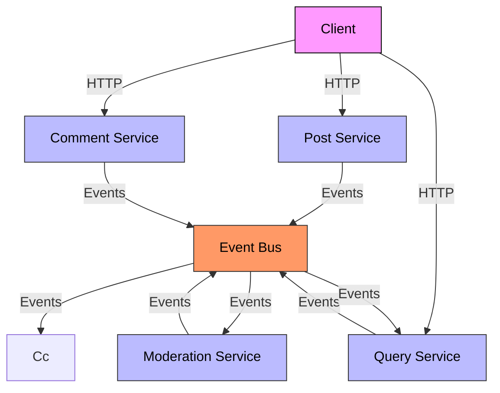
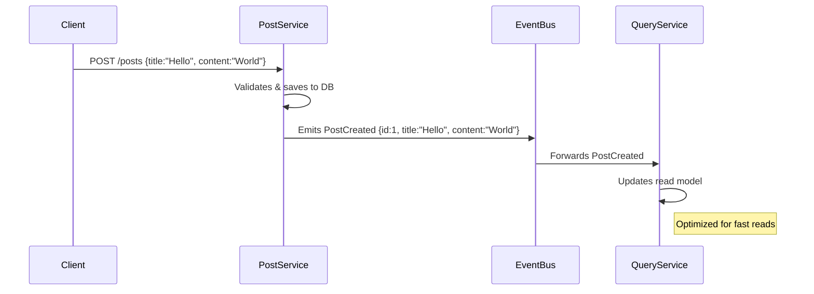
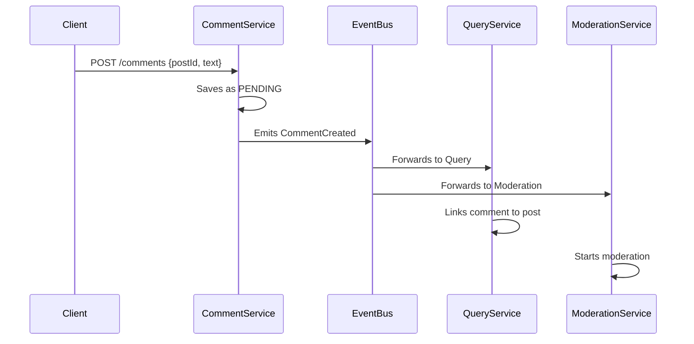
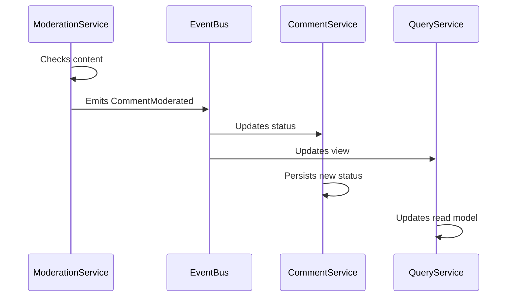
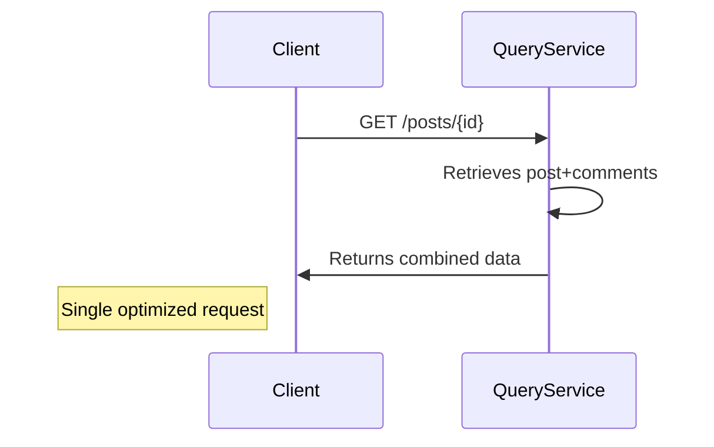
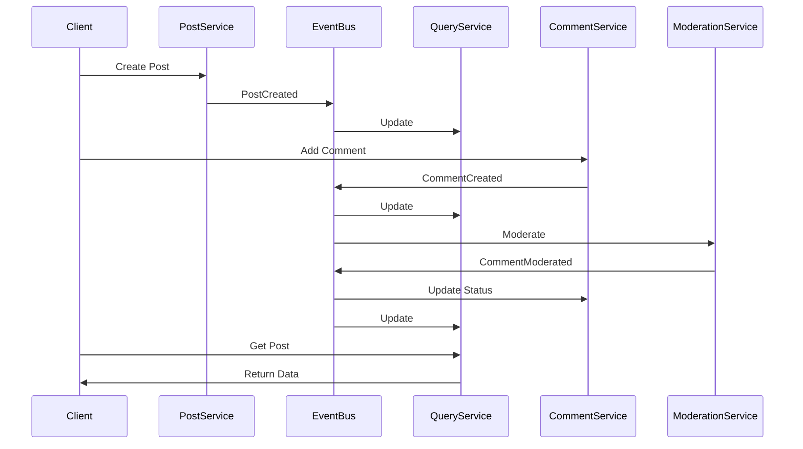

# Microservices & Event Bus Demo Project

[📖 Kubernetes Infra README](./infra/README.md)

This project demonstrates a microservices architecture with an event bus for communication between services. It was created to help understand the principles of building scalable applications using separate, independent services that work together through event-based messaging.

## Project Overview

The project consists of the following components:

- **Client**: A React application built with Vite and styled with TailwindCSS that serves as the user interface.
- **Posts Service**: An Express service that handles the creation of posts.
- **Comments Service**: An Express service that manages comments for posts.
- **Event Bus**: A central service used to receive and distribute events between microservices.
- **Query Service**: An Express service that builds a unified state from events received by other services.
- **Moderation Service**: A placeholder service intended for future content moderation functions.

## Project Structure

```
.
├── client/               # React client (frontend)
│   ├── public/           # Static assets
│   ├── src/              # Application source code
│   │   ├── index.css     # TailwindCSS and global styles
│   │   ├── main.jsx      # App entry point
│   │   └── ...           # Other React components
│   ├── index.html        # Main HTML file
│   └── package.json      # Client dependencies and scripts
├── posts/                # Posts microservice
│   ├── index.js          # Express server handling posts
│   └── package.json
├── comments/             # Comments microservice
│   ├── index.js          # Express server handling comments
│   └── package.json
├── event-bus/            # Event Bus service
│   ├── index.js          # Express server routing events
│   └── package.json
├── query/                # Query service (aggregates data)
│   ├── index.js          # Express server that aggregates events
│   └── package.json
├── moderation/           # Moderation service (placeholder)
│   ├── index.js          # Express server for future moderation
│   └── package.json
├── start.bat             # Batch script to open terminals for each service (Windows)
└── README.md             # This documentation file
```

## Architecture

The architecture of the project is depicted below:



## Detailed Workflows
📝 1. Post Creation Flow

📝 2. Comment Creation Flow

📝 3. Comment Moderation Flow

📝 4.  Data Retrieval Flow

📝 5.  Full System Interaction


### Data Flow

1. **Client (React App):**  
   - Users create posts and comments through the frontend.
   - The client makes HTTP/API calls to create posts and comments.

2. **Posts & Comments Services:**  
   - Each service processes creation requests.
   - Upon successful processing, they emit events (`PostCreated`, `CommentCreated`, etc.) to the Event Bus.

3. **Event Bus:**  
   - Receives events from the services and broadcasts them to all interested services.

4. **Query Service:**  
   - Listens for events from the Event Bus.
   - Builds an aggregated, queryable view of posts and comments for the client.

5. **Moderation Service:**  
   - Listens for CommentCreated events.
   - Checks the comment content and determines its status (e.g., rejects if it contains disallowed words like "orange").
   - Emits a CommentModerated event to the Event Bus with the result of the moderation.
   - Logs details and errors for improved debugging and monitoring

## Setup & Usage

### Prerequisites

- [Node.js](https://nodejs.org)
- npm (comes with Node.js)
- Windows Terminal (or any terminal of your choice)
- Git (optional, if cloning from a repository)

### Installation

For each component (client, posts, comments, event-bus, query, and moderation), navigate to the respective directory, install dependencies and run the service:

1. **Client (Frontend)**
   ```bash
   cd client
   npm install
   npm run dev
   ```

2. **Posts Service**
   ```bash
   cd posts
   npm install
   npm start
   ```

3. **Comments Service**
   ```bash
   cd comments
   npm install
   npm start
   ```

4. **Event Bus Service**
   ```bash
   cd event-bus
   npm install
   npm start
   ```

5. **Query Service**
   ```bash
   cd query
   npm install
   npm start
   ```

6. **Moderation Service**
   ```bash
   cd moderation
   npm install
   npm start
   ```

### Running All Services Together

For Windows users, a batch script (`start.bat`) is provided to launch all services in split-terminal panes using Windows Terminal. Simply double-click `start.bat` to open the services in a single window with multiple panes.

## Learning Objectives

- **Microservices Architecture:**  
  Understand how to design and build applications with independent services that communicate through a centralized event bus.

- **Event-Based Communication:**  
  Learn how events are used to propagate changes across different services, allowing loosely coupled integrations.

- **Frontend & Backend Integration:**  
  See how a modern frontend (React with Vite and TailwindCSS) interacts with backend services built with Express.

- **Scalability & Maintainability:**  
  Explore how the separation of concerns in microservices can lead to easier scaling and maintenance.

## License

This project is provided for learning and demonstration purposes only. No warranty is expressed or implied.

---

Feel free to contribute, provide feedback, or open issues if you have any questions or improvements to suggest.

